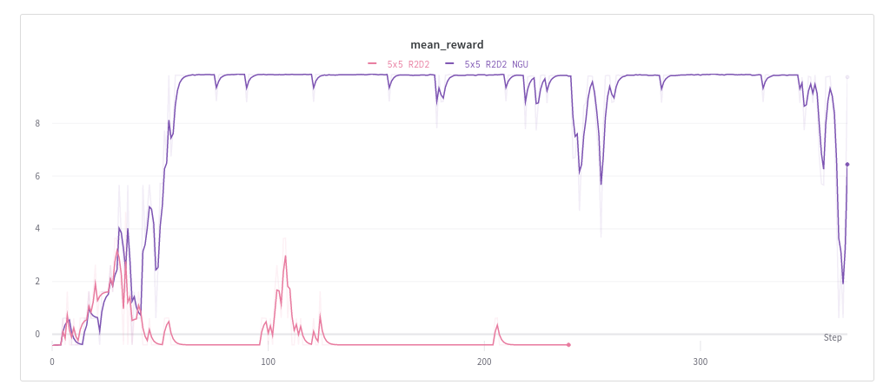

# Never give up

PyTorch implementation of Never Give Up: Learning Directed Exploration Strategies [[Paper](https://arxiv.org/abs/2002.06038)]

Only the episodic curiosity with embedding network has been implemented.

## Install
Tested with Python 3.7.9
```
pip install -r requirements.txt
```


## Train

```
python train.py
```


## Results
Results on 5x5 [gym-maze](https://github.com/MattChanTK/gym-maze) 




## Credits
R2D2 base is from [here](https://github.com/g6ling/Reinforcement-Learning-Pytorch-Cartpole/tree/master/POMDP/4-R2D2-Single) by [g6ling](https://github.com/g6ling)